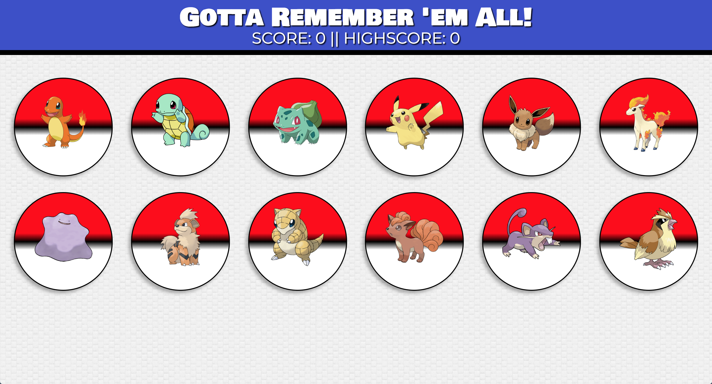

# Gotta Remember 'Em All!

## Summary
Gotta Remember 'Em All is a pokemon themed clicky game built using React. The user is tasked with clicking the images without clicking the same image twice! Remember 'em all without repeating and you win! 

## App Link
https://shrouded-citadel-86558.herokuapp.com/

## Example Image



## Technologies used
- Node.js
- Yarn
- React - https://reactjs.org/
- React-Dom - https://www.npmjs.com/package/react-dom
- Create-React-App - https://github.com/facebook/create-react-app


### Prerequisites

```
- Node.js - Download the latest version of Node https://nodejs.org/en/
```

## Built With

* Visual Studio Code
* Bootstrap 4

## Authors

* **Jess Giampietro** 